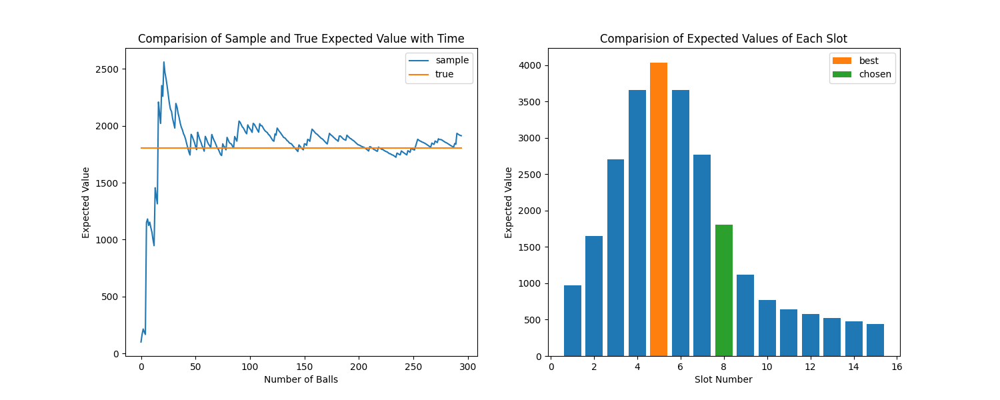

# PlinkoStat : Statitics of a Plinko Board (ECE 225A)

 ### Authors
 - Anand Kumar 
 - Shivam Singh

 ### Abstract
 Our project aims to provide an interactive real-time simulation of the Plinko Board using the `pygame` and `pymunk` packages in Python and employing Galton Board statistics to predict expected scores and guide player decisions. By integrating probability distributions, players can visualize potential outcomes based on their chosen slots. The system calculates and displays the evolving probability distribution across scoring slots, incorporating the reflective nature of the board's sides for accuracy. This unique approach enhances the strategic element of Plinko, offering players informed insights into optimal release points and expected scores. Our simulation not only provides an engaging gaming experience but also serves as an educational tool, demonstrating the seamless integration of probability theory into interactive entertainment. Through this Plinko simulation, we showcase the synergy between Galton Board principles and strategic decision-making.

## Demo Video
https://github.com/AnandK27/PlinkoStat/assets/63339285/d3e9b5e7-6724-4895-b6bd-38df8dcc2375

## Plot


## Running

1. Clone the Repository to your local directory
    ```
    git clone https://github.com/AnandK27/PlinkoStat.git
    ```

2. Install the all dependencies from [`requirement.txt`](requirements.txt)
    ```
    pip install -r requirements.txt
    ```

3. Run the main.py file in directory [`main`](main.py)
    ```
    python main.py
    ```

## User Interface (UI)

Our real-time simulation provides a wide array of interactive widgets to modify the parameters as follows

### Slot to Drop Ball ($s$)

This widget takes its input using a drop-down menu with values ranging from $1$ to $13$. The user can notice how the probability value for each bin varies based on this parameter as it determines which slot the ball will be dropped from.

### Number of Levels ($L$)

Using the drop-down menu, this parameters take in only the the odd numbers ranging from $3$ to $13$. The reason for accepting only odd numbers is to make sure the binomial coefficients have only one max value and thus removes the situation of having two bins with same max value. The user can notice that the spread(standard deviation) of the binomial distribution varies with respect to this parameter ($L$)

### Number of Balls ($N$)

We provided a slider to select the number of balls ranging from $200$ to $700$. The amount of balls in each bin changes with respect to this parameter.

### Values for Slots ($v_i$)

A text box is provided to enter the values of slots with maximum of $15$ comma separated values and if less than $15$ are provided then it randomly samples a list of $15$ values from the given list. This parameters changes the prize value for each bin and in turn changes the expected value ($\mu_{s,i}$) for each slot and the best slot to choose.

### Start and Pause

The start button, on clicked, begins the simulation with the provided parameters and the pause button can be used to freeze the simulation and resume whenever needed.

### Time-scaling ($T$)

The fast-forward and slow-down buttons are self-explanatory as they help in speeding up and down the simulation respectively. The timescale $T$, ranges from $0.5x$ to $5x$.

### Dark/Light Theme

The user also has the option to select light theme by clicking on the half-filled circle on the top left of the interface window which will result in the colors

### Plot Button

The plot is enabled after all the balls reach their respective bins as shown in [plot](#plot).


## We have provided documentation for all the modules used [here](documentation.md).


